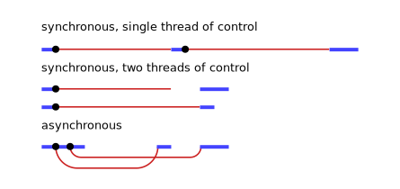
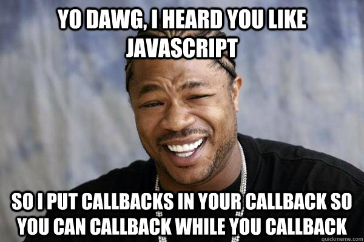

[The World's Most Misunderstood Programming Language](http://crockford.com/javascript/), JavaScript has a lot of real awesome engineering under the hood. It's the language of the World Wide Web in it's own right. JavaScript is designed for the web, that means it's supposed to be asynchronous, often this is what creates confusion among most people trying to learn the language for the first time.

## But what the heck is Asynchronous?

In _synchronous_ programs, if you have two lines of code (L1 followed by L2), then L2 cannot begin running until L1 has finished executing. While as in _asynchronous_ programs, you can have two lines of code (L1 followed by L2), where L1 schedules some task to be run in the future, but L2 runs before that task completes. This is not to be confused with a multithreaded execution. JavaScript utilizes as single thread for execution.


*Asynchronous execution. Source: [https://eloquentjavascript.net](https://eloquentjavascript.net/)*

The `setTimeout` function is probably the simplest way to asynchronously schedule code to run in the future:

```javascript
// Say Hello.
console.log(Hello.);
// Say Goodbye two seconds from now.
setTimeout(function() {
		console.log(Googbye!);
}, 2000);
// Say Hello again!
console.log(Hello again!);
```

If you are only familiar with synchronous code, you might expect the code above to behave in the following way:

*   Say Hello.
*   Do nothing for two seconds.
*   Say Goodbye!
*   Say Hello again!

But `setTimeout` does not pause the execution of the code. It only schedules something to happen in the future, and then immediately continues to the next line.

*   Say Hello.
*   Say Hello again!
*   Do nothing for two seconds.
*   Say Goodbye!

### Why we need Async?

An asynchronous nature is requisite because of the environment JavaScript is built to work in and the kind of interactions it is used to accomplish. When building real-world applications, you are going to need to access resources or interact with applications on the outside, for instance look at the following code.
```javascript
// CoursePage.vue
mounted() {
	this.getCourseDetails().then(data => this.course = data);
	this.getTopics().then(data => this.topicData = data);
},
methods: {
	getCourseDetails() {
		return lms.call('get_course_details', {
			course_name: this.courseName
		});
	},
	getTopics() {
		return lms.call('get_course_topics', {
			course_name: this.courseName
		});
	}
}
```
From a project I've been working on, it is a [Vue](https://vuejs.org) component that makes two API calls using the `lms.call()` function. Both `getCourseDetails()` and `getTopics()` is supposed to execute once the component is mounted. Now each of these make an HTTP request to an API endpoint that performs certain operations and returns some data. The thing about these operations is that **they take time**; there’s always a delay between the start of the operation and the response. And for JavaScript, this presents a very fundamental problem.

Since JavaScript is single threaded, the browser can’t interrupt a running script, Even if the script is just waiting for the server to complete a certain task, the browser will simply be stuck, it can't even render any UI, listen to any interactions.

You can even simulate this nature in your browser right now. [Open the JS Console in your browser](https://webmasters.stackexchange.com/a/77337) and type in the following code:

```javascript
function wait(ms) {
	let waitUntil = Date.now() + ms
	while (Date.now() < waitUntil) { continue }
}
```
Now all you have to do is call this function. Typing in `wait(10000)` will freeze your browser for 10 seconds. Trying selecting a text or clicking any link during that time. Even closing the tab won't work until 10 seconds are up. For this reason JavaScript cannot multitask if it were to be synchronous. This is the reason why JavaScript **has** to be asynchronous.

### Understanding Callbacks

Callbacks are functions which are sent as an argument to another function and are invoked when a certain event like a HTTP response happens. It's essentially a stub or a piece of code that you’ll pass to the function say `setTimeout()` that the browser will store until needed. Then when an event of interest occurs, such as a timeout or HTTP response, the browser can handle it by executing the stored callback function. Again here it is important to understand thatwhen you initiate an operation like a timeout or a request, the browser does not wait for it to continue, the script just keeps on executing. The callback is executed only **after** the original script has fully executed. The following is probably the simplest example of a callback:

```javascript
function greeting(name) {
		alert('Hello ' + name);
}
function processUserInput(callback) {
		var name = prompt('Please enter your name. ');
	callback(name);
}
processUserInput(greeting);
```

Real world usage of callbacks can actually result in some pretty bad looking code, often referred to as callback hell, and if you have been a JS developer for a while you might have heard the phrase _callback hell_ before. [callbackhell.com](http://callbackhell.com) is probably the best site to look if you wanna understand callback hell.



Callback-based code inevitably ends with developers having to write pretty much unreadable and even unmaintainable code to some extent. And until promises arrived on the scene, complex callbacks were required to do _anything_ useful with JavaScript.

## Introducing Promises

A Promise is an object that represents the completion, either success or failure of an asynchronous operation as well as its resulting value. The way we use promises is that instead of passing callbacks into a function, a promise is a returned object to which you attach callbacks.

Unlike old-style, _passed-in_ callbacks, a promise comes with some guarantees:

*   Callbacks will never be called before the [completion of the current run](https://developer.mozilla.org/en-US/docs/Web/JavaScript/EventLoop#Run-to-completion) of the JavaScript event loop.
*   Callbacks added with [`then()`](https://developer.mozilla.org/en-US/docs/Web/JavaScript/Reference/Global_Objects/Promise/then) even _after_ the success or failure of the asynchronous operation, will be called, as above.
*   Multiple callbacks may be added by calling [`then()`](https://developer.mozilla.org/en-US/docs/Web/JavaScript/Reference/Global_Objects/Promise/then) several times. Each callback is executed one after another, in the order in which they were inserted.

One of the great things about using promises is **chaining**. This allows us to write code that executes in the order you'd expect. Semantically this is much more readable and maintainable.

The following two examples can help you understand the apparent difference between them.

```javascript
// With traditional passed-in Callbacks

doSomething(function(result) {
	doSomethingElse(result ,function(newResult) {
		doFinalStep(newResult, function(finalResult) {
			console.log('Got the final result: ' + finalResult);
		}, failureCallback);
	}, failureCallback);
}, failureCallback);


// With Promises
doSomething()
	.then((result) => { return doSomethingElse(newResult) })
	.then((newResult) => { return doFinalStep(newResult) })
	.then((finalResult) => { console.log('Got the final result: ' + finalResult) })
	.catch(failureCallback)
```

Promises give you the performance benefits of asynchronous code, without the loss of clarity.

### Writing Promises

The syntax for a Promise is simple: `new Promise(executor);`. The `executor` is a function that is passed with the arguments `resolve` and `reject`.

```javascript
API.call = function(args) {
	return new Promise((resolve, reject) => {
		return axios.create({...args}).then(response => {
			if (response.ok) {
				resolve(response)
			} else {
				reject(new Error('error'))
			}
		});
	});
};
```

> P.S. There's a better way to write that function

### The Async-Await syntax

The other way of creating promises is the `async-await` syntax. Without explicitly writing promises. `async/await` is arguably a more elegant way of writing asynchronous code, giving it a more synchronous feel semantically. Using async and await you can implicitly create promises and handle them as well.

Here's the syntax for it

```javascript
async function name([param[, param[, ... param]]]) {
	statements
}
```
Let's look at the following example

```javascript
// Using classic Promise Syntax
getData(args) {
	return asyncFunction(args)
		.then(result => doSomething(result))
		.then(nextResult => doSomethingElse(nextResult))
		.catch(err => {
				console.error('fetch error', err);
		})
}
```

```javascript
// Using aync-await
async getData(args) {
	try {
		const result = await asyncFunction(args);
		const nextResult = await doSomething(result);
		const await doSomethingElse(nextResult);
	}
	catch (err) {
		console.error('fetch error', err);
	}
}
```

As you can see `async-await` provides a much nicer syntax in more complex scenarios with loops or certain other constructs like `try-catch`.

There are many benefits to this new scheme.

1.  **Cleaner error stacks.**
2.  **Better debugging.** Breakpoints can very well be written inside the `.then` block, but on stepping over, the debugger will not move to the next `.then` because it only “steps” through synchronous code.
3.  **Code sanity.** You can handle both asynchronous and synchronous errors with the same construct, good old `try/catch`. This can help reduce duplication as well as improve code readability.

If you want to learn how this works under the hood, I highly recommend watching this [talk](https://vimeo.com/254947206) by [Jake Archibald](https://jakearchibald.com/) at SmashingConf and maybe also read this [article at MDN](https://developer.mozilla.org/en-US/docs/Web/JavaScript/EventLoop).

Learning about asynchronous programming is probably the first step in mastering JavaScript, and this article covered pretty much all you need to get started. More about JavaScript in future blogs.