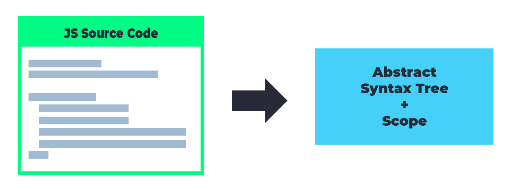
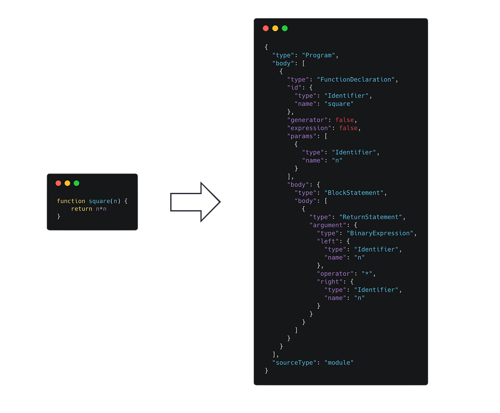
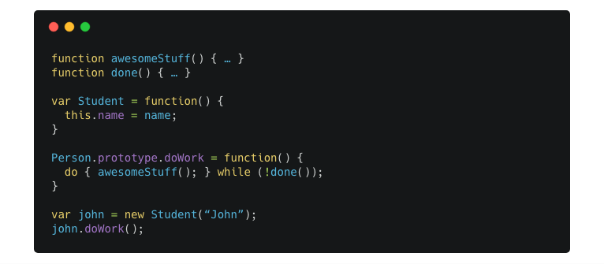
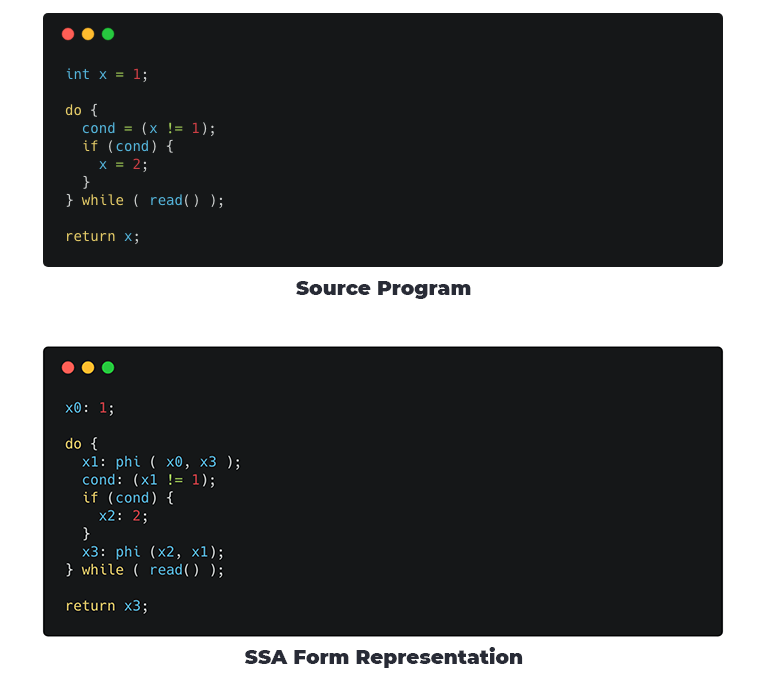
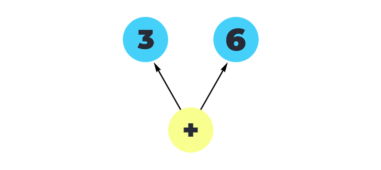
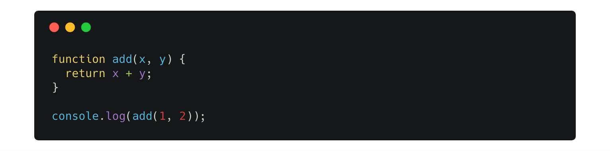
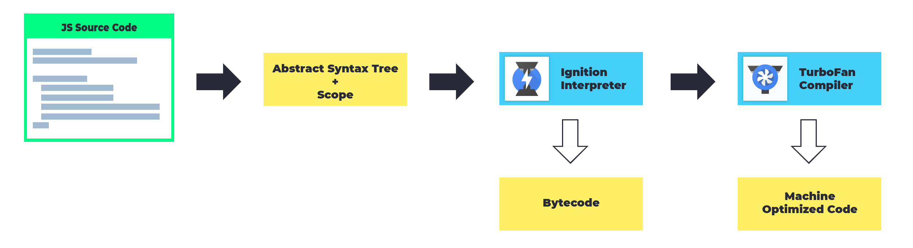

# What you must know about JavaScript

Twenty years ago JavaScript was just another [Turing-complete](https://stackoverflow.com/questions/7284/what-is-turing-complete) language that was used to create annoying pop-ups and maybe some fancy animations, but today this has largely changed. JavaScript has found it's place in servers, mobile applications, desktop applications and obviously your browser. One such awesome project is [FrappeJS](https://github.com/frappe/frappejs) which is a Node + Electron + Vue based framework inspired by [Frappe](https://github.com/frappe/frappe).

JavaScript is unlike any other programming language, the single most important difference is that JavaScript is a single-threaded language. Other things to know about it is that it is a non-blocking, asynchronous and concurrent object oriented scripting language. Much of what JavaScript is, is made possibly by its just in time compiler (that means it is an interpreted language) and the fact that it's prototype based rather than class based.

## Prototype Based Programming

Prototype-based programming is a style of object-oriented programming in which classes are not explicitly defined, but rather derived by adding properties and methods to an instance of another class or, less frequently, adding them to an empty object. To understand this better we must see the contrast between Prototype based languages and Class based languages

Object oriented languages like C++ are founded on two concepts viz. `Classes` and `Instances`

*   A class is an abstract representation of an object. It is like a template that defines the behaviour as well as the properties of an object.
*   An instance is an instantiation or a member of a class. It is an object in memory.

For JavaScript there is no such distinction, it uses a _prototypical object_, an object used as a template from which gives us the initial properties for a new object. Any object can specify its own properties either when we create it or even at runtime. In JS nearly all objects in JavaScript are instances of [`Object`](https://developer.mozilla.org/en-US/docs/Web/JavaScript/Reference/Global_Objects/Object), a typical object inherits properties (including methods) from `Object.prototype`. This allows the creation of an object without first defining its class.

In addition, any object can be associated as the _prototype_ for another object, allowing the second object to share the first object's properties, this also means that if you add a property to an object that is used as the prototype for a set of objects, the objects for which it is the prototype also get the new property.

# The Engine

JavaScript needs a runtime, this is provided by JS Engine. It's the part of your browser that takes the JS code and executes it. Each popular browser has it's own implementation of a runtime.

*   Chrome has [V8](https://v8.dev/)
*   FireFox has [Spidermonkey](https://developer.mozilla.org/en-US/docs/Mozilla/Projects/SpiderMonkey)
*   Edge has [Chakra](https://github.com/Microsoft/ChakraCore)
*   Safari has [JavaScriptCore](https://trac.webkit.org/wiki/JavaScriptCore)

A JavaScript engine is a kind of process virtual machine (much like [wine](https://www.winehq.org/)) that is designed specifically to interpret and execute JavaScript code. Chrome's V8 is one of the most popular ones, it powers the Node environment ([read more](https://codability.in/an-introduction-to-node-js/)) and is considered to be the one fastest JS Engines yet.

Generally speaking, executing JavaScript requires the following steps

1.  Parsing the code to generate AST
2.  Compiling the parsed code (usually done by a baseline and an optimising compiler)

Most of what you will read next is in context to V8, however it is not very different for the other engines.

# Parsing JavaScript

*Parser*

The first step in executing JavaScript code is parsing the code, the parser generates data structures, AST and Scope. AST or abstract syntax tree is a tree representation of the syntactic structure of the JavaScript code, Scope is another data structure that maintains variable proxies which in turn helps manage scope and reference of variables within functions. Parsing directly affects the JavaScript start-up performance. This matters as it can delay how soon users can interact with our site.

Broadly speaking parsing involves two steps lexical analysis and syntax analysis. Lexical analysis involves reading a stream of characters from our code and combine them into tokens, it also involves removal of white space characters, comments, etc. In the end, the entire string of code will be split into a list of tokens. Syntax analyser, also called parser, will take a plain list of tokens after lexical analysis and turn it into a tree representation, and also validates the language syntax.

The following is the result of both operations for a simple function.

*AST for a simple square function. Built using https://astexplorer.net/*

V8 had two separate parsers (currently only one, explained later) with slightly different purposes, they are _Parser_ and _PreParser_, Parser is the full eager one which is responsible for building the AST and scopes as well as finding syntax errors. The PreParser is the lazy one, and obviously the faster one _(Twice as fast ⚡️)_. This is required because a lot of web pages ship a lot of code they don't execute. PreParser does not build an AST, even though it builds scopes but it doesn't put a lot of references or declarations in it. It basically skips over the functions we don't wish to compile right now. How does it know that? There are a few simple rules, all top level code, [Immediately Invoked Function Expressions (IIFEs)](http://adripofjavascript.com/blog/drips/an-introduction-to-iffes-immediately-invoked-function-expressions.html) or any functions recognised as IIFEs are eager executed, other top level functions that are not IIFEs are skipped over, and noted by PreParser, and are eager parsed later when the function is called.

> You can add an exclamation mark before a function to inform the parser that you want to eager parse it.

Now that we have an AST and the scope ready, it's turn for the interpreter to take over, V8 has _Ignition_ that generates bytecode from the syntax tree.

# Generating ByteCode

JavaScript engines need to be fast, so to do this these engines employ [just-in-time (JIT) compilation](https://en.wikipedia.org/wiki/Just-in-time_compilation). This compiles the script to native machine code immediately prior to execution. Generally speaking code is initially compiled by a baseline compiler, which can generate non-optimized machine code quickly. The compiled code is analysed during runtime and optionally re-compiled dynamically with a more advanced optimising compiler for peak performance. _Ignition_ is that baseline compiler, only in this case, it's actually an interpreter. It replaced the older _full-codegen._

> Ignition is a register machine or a stack machine with an [accumulator register,](https://en.wikipedia.org/wiki/Accumulator_(computing)) that generates and interprets bytecode using the AST provided by the parser. Bytecode is an abstraction of machine code.

Previously when a script loads in your browser and the engine decides to parse and compile it, first thing that it needs to do is run the top level code of the script, so for this the _full-codegen_ compiles that block of code and it tries to do it as fast as it can. Obviously the lazy parsing tries to reduce the amount of the work it had to do by letting it skip through the code that need not be compiled right away, but the lazy stub is still waiting to be parsed by the Parser and compiled when it's called, so we effectively parse the function twice, once by the lazy parser and secondly when it's called. That's just partly the problem.

Now consider the following code

Here both `var Student = function()` and `Person.prototype.doWork =` _`function`_`()` is lazy parsed initially and when the class is instantiated and `doWork` is called the function body is parsed and compiled. But the function `doWork` has a loop, so it parses the function again, produces a optimised version for it and then switches to using that optimised version, this is called [on stack replacement](https://stackoverflow.com/a/9105846). But we can't do away with the old unoptimised code because of the way JavaScript works. Because let's say, the programmer decides to [monkey patch](https://www.sitepoint.com/pragmatic-monkey-patching/) a few things it will reflect on the AST and since AST is the ultimate source of truth, v8 will have to jump back to the unoptimised code. The issues with this approach (in addition to architectural complexity) is that the JITed machine code can consume a significant amount of memory, even if the code is only executed once. Ignition was created as an improvement to this. Ignition is a bytecode interpreter for v8\.

Using an interpreter very easily solves a portion of the memory problem, since the footprint of the interpreted bytecode is quite less as compared to the machine code. Also this small footprint means there is less parsing overhead which allows use to parse the entire script in an eager fashion. **No need for a PreParser! Yayyy!**

This also reduces the complexity, since the AST generated is for the entire of the script and not just pieces of it, the bytecode generated from this AST can be considered as the source of truth.

*Ignition, the interpreter, generates bytecode from syntax tree*

Ignition enables run-once or non-hot code to be stored more compactly in bytecode form. Since the bytecode is smaller, compilation time is much reduced, and we will also be able to be more eager about initial compilation, which significantly improve startup time. An added advantage is that the bytecode can be fed into a Turbofan graph generator directly, thereby avoiding the need to reparse the JavaScript source code when optimising a function in TurboFan. Explained Next!

Learn more about ByteCode in this [blog](https://medium.com/dailyjs/understanding-v8s-bytecode-317d46c94775) by [Franziska Hinkelmann](https://twitter.com/fhinkel).

# TurboFan

During interpretation of the generated bytecode, Ignition collects _profiling information_ or _feedback_ about the inputs to certain operations. Some of this feedback is used by Ignition itself to speed up subsequent interpretation of the bytecode. But predominantly this feedback collected is consumed by the _TurboFan JavaScript compiler_ to generate highly-optimised machine code. Turbofan implements a certain technique called _Speculative Optimisation_ and is inspired by a concept call a _Sea of Nodes._

## Sea of Nodes

All computations are expressed as nodes in the sea of nodes and the edges represent dependencies between computations. This approach allows better performing JIT complied code. Sea of Nodes is based on _[SSA](https://en.wikipedia.org/wiki/Static_single_assignment_form)_ or _[Single Static Assignment](https://en.wikipedia.org/wiki/Static_single_assignment_form)_. This is a way of structuring the intermediate representation of a code block/program so that every variable is assigned exactly once. This is useful is [redundancy elimination](https://en.wikipedia.org/wiki/Partial_redundancy_elimination)_._

> Some common ways of redundancy elimination are value numbering, conditional constant propagation, common-subexpression elimination (CSE), partial-redundancy elimination. Each come with their own suite of benefits as well as problems.

Static single-assignment form represents [use-def](https://en.wikipedia.org/wiki/Use-define_chain) information explicitly and arranges for every value computed by a program to have a unique assignment/definition. A method is in SSA form if every variable has (statically) exactly one definition.

So for a Sea of Nodes, each SSA data value is represented as a node in a graph. A node produces a value. (eg, Add 3 + 6). A node points to its operands (the constants 3 and 6). There is no other extra data

*Node Representation for 3 + 6*

In a sea of Nodes, Nodes express computation they can be constants, parameters, arithmetic, load, store or even calls. Edges express dependencies. This benefits largely by reducing redundancy. Nodes not reachable from end are _dead_. This can including dead controls, dead effects, dead computation, etc. Because of this dead code never placed in final schedule, when compiling. This allows TurboFan to leave out a lot of cases that it doesn’t need to handle, which is extremely important to execute JavaScript at peak performance. This form of representation also isolates parsing of this graph from error-prone ordering of computations.

If you want to learn about Sea of Nodes in detail, here is a wonderful [blog](https://darksi.de/d.sea-of-nodes/) by [Fedor Indutny](https://github.com/indutny).

## Speculative Optimisation

Consider the following code:

He we know that in the case of `x+y`, both `x` and `y` are numbers, we don’t need to handle the cases where either of them is a string, or arbitrary JavaScript objects.

Since JavaScript is dynamically typed, there is no way to know the exact types of values until runtime. Therefore we need to speculate, based on previously collected feedback about the values we’ve seen so far, and then assume that we’re going to always see similar values in the future. This might sound fairly limited, but it has proven to work well for dynamic languages like JavaScript.

In this particular case, we collect information about the input operands and the resulting value of the + operation (the `Add` bytecode). When we optimize this code with TurboFan and we’ve seen only numbers so far, we put checks in place to check that both `x` and `y` are numbers (in that case we know that the result is going to be a number as well). If either of these checks fail we go back to interpreting the bytecode instead — a process called _Deoptimization_. Thus TurboFan doesn’t need to worry about all these other cases of the `+` operator and doesn’t even need to emit machine code to handle those, but can focus on the case for numbers, which translates well to machine instructions.

If you want to learn about Speculative Optimisation in detail, here is a wonderful [blog](https://ponyfoo.com/articles/an-introduction-to-speculative-optimization-in-v8) by [Benedikt Meurer](https://twitter.com/bmeurer)

# The Execution Pipeline

This diagram gives a simplified (over-simplified) representation of the complete JS Execution pipeline. There is much more to be read beyond the things explained here. Be sure to follow the [v8 team](https://v8.dev/blog) to learn more about the project and how it all works.

<figure class="\&quot;kg-card" kg-image-card="" kg-width-wide="">

*How V8 executes JavaScript*

# Concluding

This is the first part of the Over Explained series, future blogs will cover garbage collection, an important part in making JavaScript faster on your devices, JS Event loop and other things.

P.S. Most developers need not worry about choosing the best algorithms and data structures, and instead can focus on the application design. You can admire the engineering though.